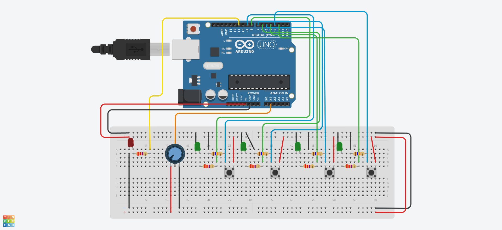

ifdef::env-github[]
:tip-caption: :bulb:
:note-caption: :information_source:
:important-caption: :heavy_exclamation_mark:
endif::[]

= Track the led fly

//video::474173507[vimeo, height=400, width=700, align="center"]

[IMPORTANT]
====
Rispetto alle specifiche fornite, nell'implementazione del progetto ci sono due modifiche:

- il led stem:[L_s] è di colore giallo invece che rosso;
- sia i led rossi che i verdi hanno lo stesso ruolo dei led verdi nelle specifiche.
====

== Scelte progettuali

* Per la realizzazione del progetto sono state impiegate le librerie https://github.com/GreyGnome/EnableInterrupt[EnableInterrupt] e https://github.com/cake-lier/MiniTimerOne[MiniTimerOne].

** La libreria *EnableInterrupt* è stata impiegata per sopperire alla necessità di avere a disposizione un pin con interrupt per ogni pulsante tattile. Normalmente infatti si possono associare interrupt solo ai pin 2 e 3.

** *MiniTimerOne* è stata scelta perché permette di risolvere una https://github.com/PaulStoffregen/TimerOne/issues/9[problematica] riscontrata con la libreria https://github.com/PaulStoffregen/TimerOne[TimerOne] che può provocare interrupt indesiderati.

* Per gestire il fenomeno del https://www.allaboutcircuits.com/textbook/digital/chpt-4/contact-bounce/[contact bounce] inizialmente si è pensato di impiegare una libreria apposita, come https://github.com/ubidefeo/FTDebouncer[FTDebouncer], ma alla fine si è preferito un approccio meno strutturato in modo da potersi confrontare in modo più diretto con l'implementazione di un meccanismo di debouncing.

== Schema del circuito

[NOTE]
====
È possibile definire il simbolo `DEBUG`, nell'header file `trackTheLedFly.h`, per disporre di maggiori informazioni sul comportamento del programma. In particolare si hanno informazioni relative ai tre stati in cui si può trovare il gioco e alle corrispondenti transizioni:

- `[A]` indica lo stato iniziale;
- `[A->B]` indica la transizione dallo stato iniziale al gioco vero e proprio;
- `[B]` indica lo stato di gioco;
- `[B->C]` indica la transizione dallo stato di gioco alla fase finale;
- `[C]` indica lo stato di fine gioco;
- `[C->A]` indica la transizione dallo stato di fine gioco allo stato iniziale.

====
